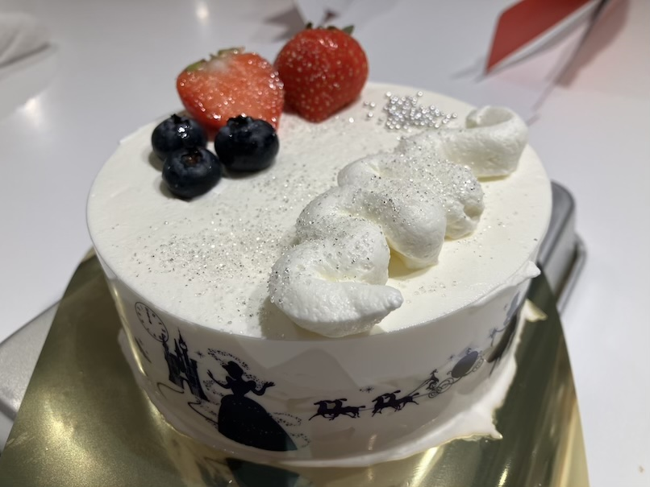

# クリスマスケーキ

## 具材

4人分

- スポンジ
  - 卵3つ
  - グラニュー糖
  - 薄力粉
- クリーム
  - 生クリーム
  - グラニュー糖
  - 牛乳

## 調理方法

### スポンジを作る

1. 卵とグラニュー糖を入れて、機械で混ぜまくる。マヨネーズ色になるまでひたすら混ぜる
2. 薄力粉を入れて、ヘラでJを書くイメージで混ぜる
3. 混ぜた生地を広い器に広げて、平らにしてオーブンで焼く

### クリーム

1. 生クリームとグラニュー糖を混ぜる。大きくなるまで混ぜる
2. 牛乳を入れて混ぜる
3. 冷蔵庫で冷やす

### 仕上げ

1. スポンジをオーブンから取り出し、円状の器具で型作って取り出す
2. 甘いシロップを生地を塗るとよりGood
3. 円状の囲いを作って、そこに生地を入れて、クリームを入れていく、それを繰り返していけば完成

## 参考

なし
