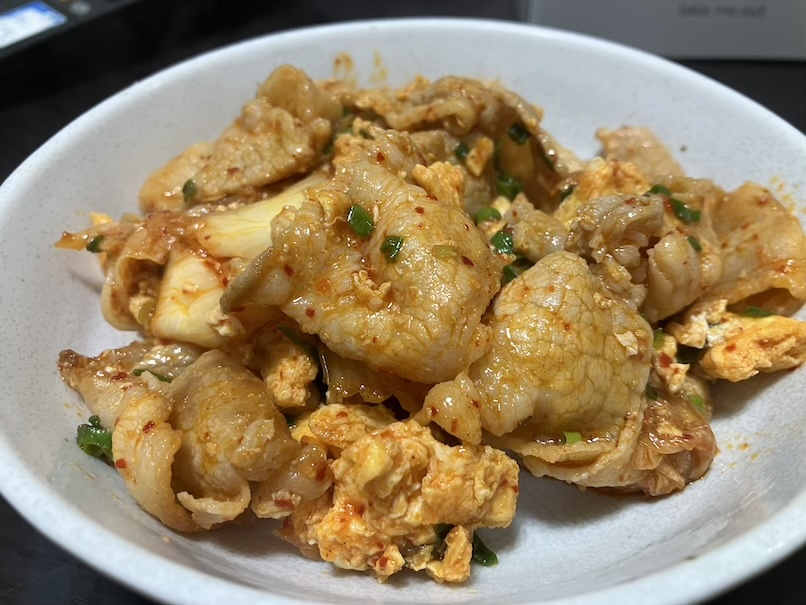

# 卵入り豚キムチ

## 具材

4人分

- 卵2個
- 豚バラ
- キムチ
- ゴマ油
- しょうゆ
- オイスターソース

## 調理方法

1. 卵をといて、油を引いたフライパンでふんわり焼く
2. 焼いた卵を取り出して、ゴマ油を引く
3. 豚バラを炒める
4. キムチを入れて、しょうゆ小さじ1、オイスターソースを少し入れて炒める
5. 卵を入れて炒める

## 参考

[【簡単】卵入り豚キムチ【ズボラ】](https://youtube.com/shorts/WDufm7acTrk?si=TjQK_AeNIBZO_YJI)
