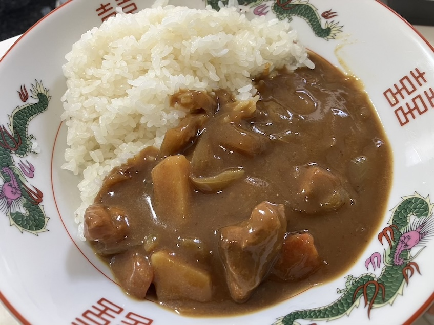

# 某うどん屋さん風カレー

## 具材

4〜6人分

- 鶏肉
- 玉ねぎ
- ジャガイモ
- 人参
- バーモンドカレールー辛口 分量:1
- ジャワカレールー辛口 分量:1
- 水
- ①塩胡椒
- ②味の素
- ②しょうゆ
- ②ウスターソース
- ②はちみつ
- ②牛乳

## 調理方法

1. 玉ねぎと鶏肉、ジャガイモ、人参を食べやすいサイズに切る
2. 油を引いて、玉ねぎを茶色くなるまで炒める
3. 玉ねぎを取り出し、鶏肉、ジャガイモ、にんじんを炒める。鶏肉には①塩胡椒をふる
4. 玉ねぎも入れて、火を強火にして、水を入れて沸騰するまで待つ（10分ぐらい）
5. 沸騰したら、火を弱火にしてバーモンドカレーとジャワカレーのルーを入れて、ルーを溶かす
6. ②を入れて、混ぜる
7. 弱火にした状態で15分待ったら完成

## 参考

なし
