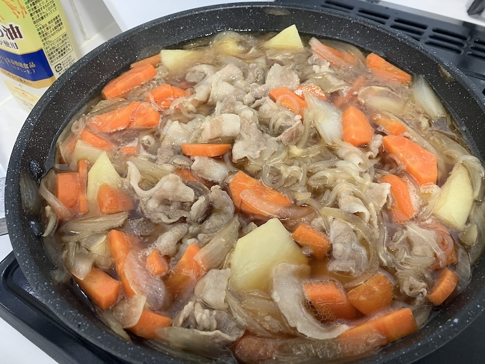

# 肉じゃが

## 具材

6人分

- 豚バラ
- ジャガイモ
- 人参
- 玉ねぎ
- 白滝
- 水
- 醤油
- 砂糖
- みりん
- 味の素

## 調理方法

1. 豚バラを切って、砂糖と醤油でを加えて揉む
2. ジャガイモ、玉ねぎ、人参を切る。ジャガイモは５分間水につけておく
3. フライパンに油を引いてジャガイモと玉ねぎを炒める
4. 豚バラを入れて炒める
5. 人参と白滝を入れて炒める
6. 水を注ぐ
7. 砂糖、醤油、みりんを少し、味の素入れて煮込む
8. 沸騰したら蓋をして15分ぐらい余熱で置いておく

## 参考

[なんて完全な…肉じゃがなんだ【ASMR](https://youtube.com/shorts/7fClf2ja4gc?si=VWKknmnEaXGkSaGb)
