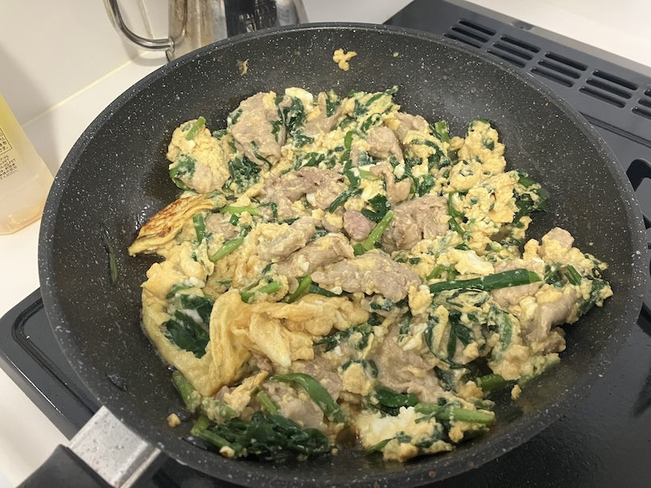

# 豚ニラ玉

## 具材

１〜2人分

- 豚肉
- ニラ
- 卵4個
- ①塩胡椒
- ①味の素
- ②しょうゆ 分量:2
- ②みりん 分量:2
- ②ウスターソース 分量:1

## 調理方法

1. 卵を溶いて塩胡椒多め、味の素7回振る
2. フライパンに油を引いて豚肉を先に炒めてからニラを炒める
3. 具材②を混ぜたものをフライパンに入れて水分がある程度飛ぶまで炒める
4. 豚肉とニラを1.に入れる
5. フライパンに油を多めに引いて、4.を入れる
6. 卵がふわっとなるくらい炒めたら完成

## 参考

[☆ご飯が進む～♪ニラ玉☆](https://cookpad.com/jp/recipes/22640425-%E3%81%94%E9%A3%AF%E3%81%8C%E9%80%B2%E3%82%80%E3%83%8B%E3%83%A9%E7%8E%89)

[今までのニラ玉はなんだったのかと思うほどの旨さです。究極の半熟【至高のニラ玉】](https://www.youtube.com/watch?v=hu9-lXWwKWQ&t=264s)
