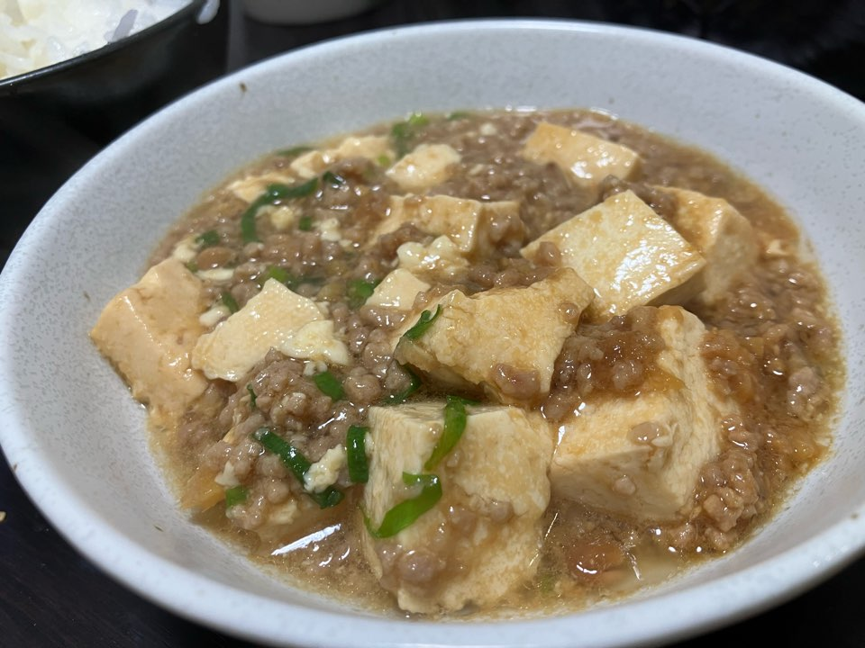

# 麻婆豆腐

## 具材

4人分

- 生姜
- にんにく
- 木綿豆腐
- ごま油
- 赤味噌
- 醤油
- みりん
- ひき肉
- 鶏ガラスープ（水）
- ネギ
- 水溶き片栗粉

## 調理方法

1. 木綿豆腐を切る
2. 生姜とニンニクをみじん切りにする
3. フライパンにごま油を引いて、1.を炒める
4. 赤味噌とひき肉を入れて炒める
5. 醤油とみりんを入れる
6. 木綿豆腐を入れて炒める
7. ネギと鶏がらスープを入れて、様子を見る
8. 水溶き片栗粉を入れてとろみをつける

## 参考

[純和風・麻婆豆腐そして丼へ](https://youtube.com/shorts/u08xnIb1pNc?si=I_ALI4sW5fmYo_Sn)
